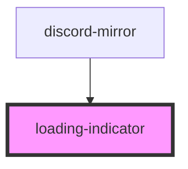

# loading-indicator

<!-- Auto Generated Below -->

## Shadow Parts

| Part                | Description |
| ------------------- | ----------- |
| `"loading-spinner"` |             |
| `"loading-text"`    |             |

## Dependencies

### Used by

 - [discord-mirror](../discord-mirror)

### Graph

----------------------------------------------

*Built with [StencilJS](https://stenciljs.com/)*
